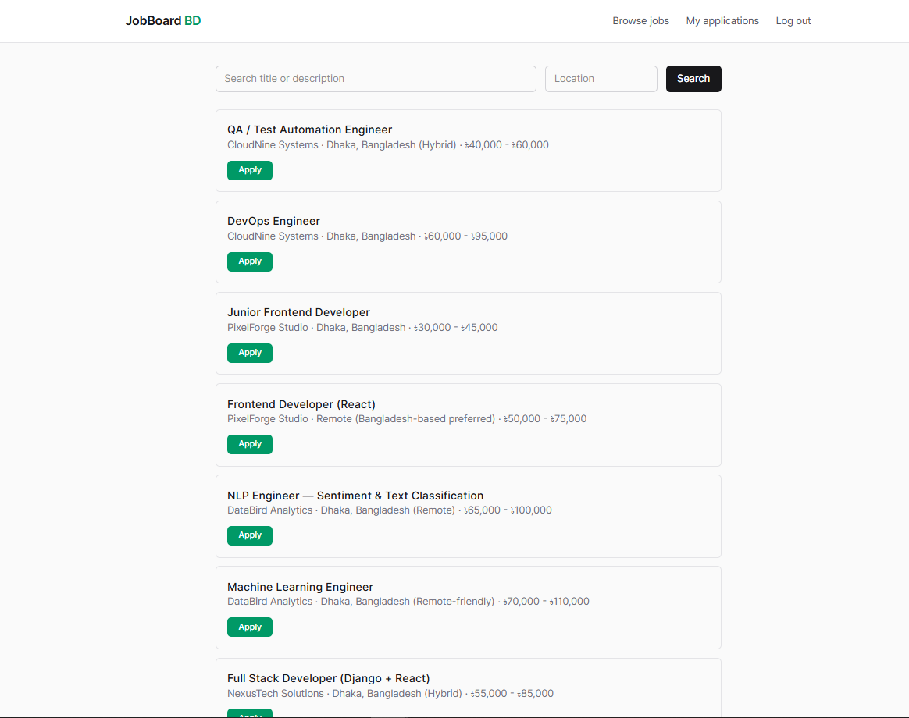
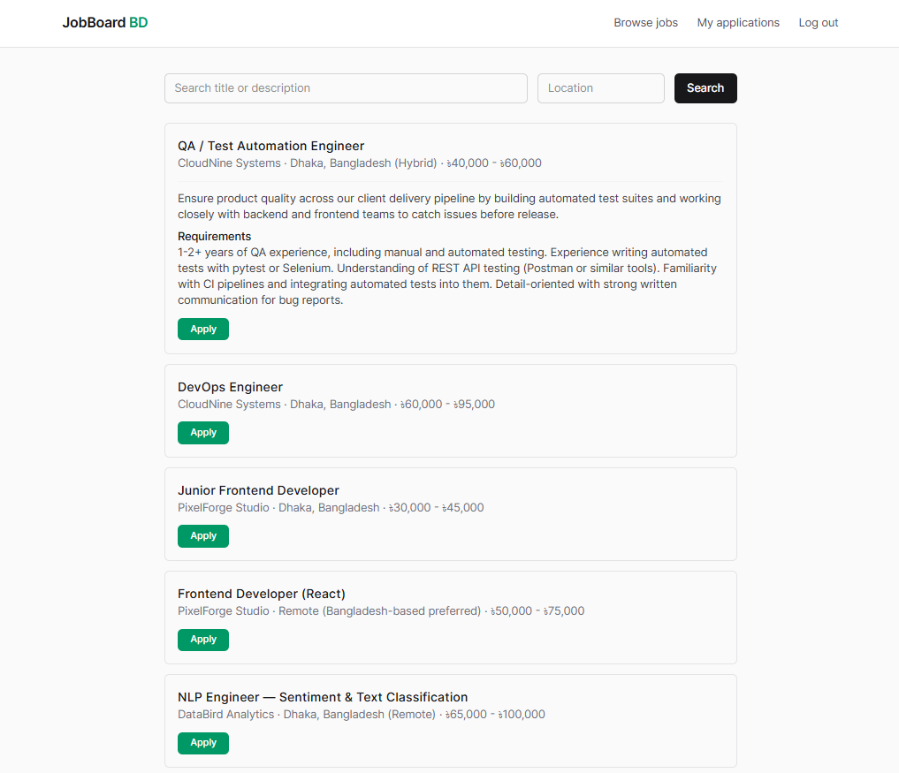
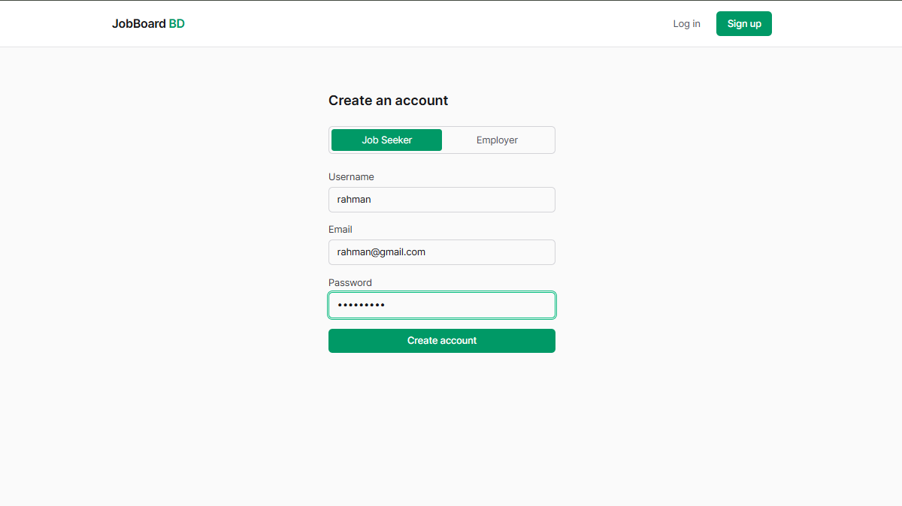
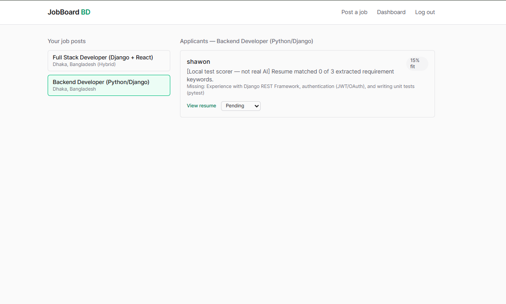
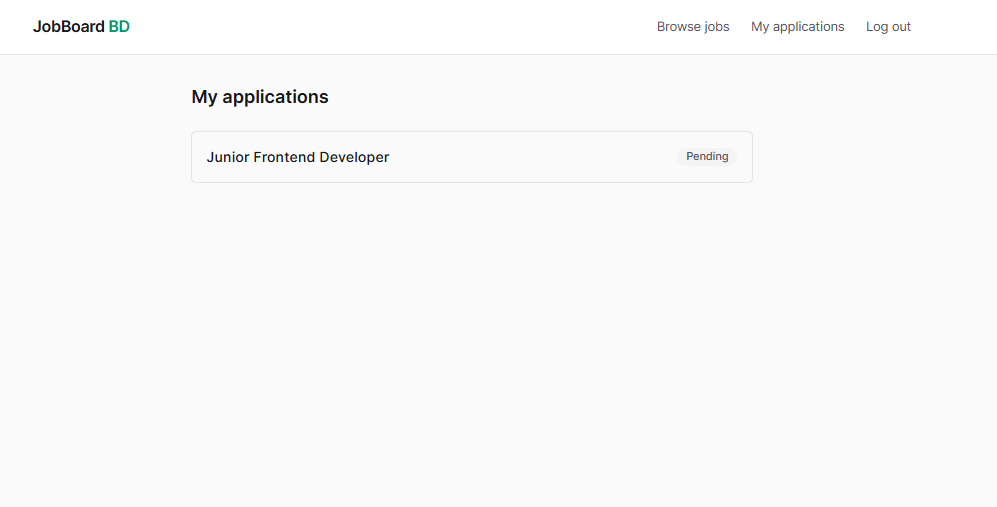
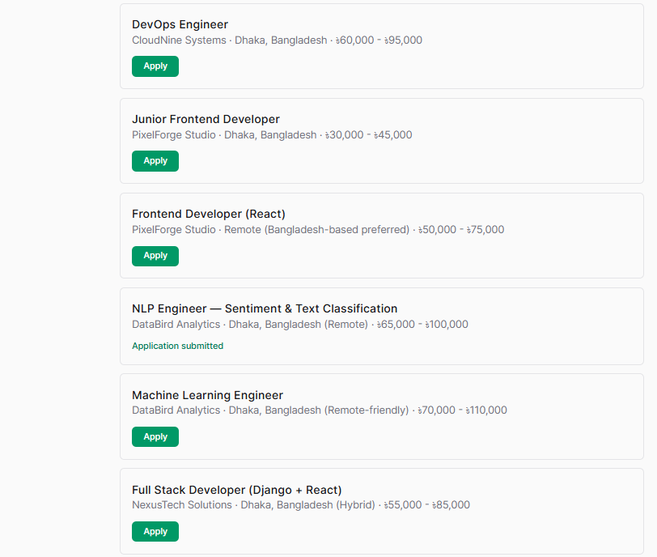

# JobBoard BD

A full-stack job board for the Bangladeshi market where employers post jobs and job seekers apply — with an AI layer that scores resume-to-job fit for every application, so employers can rank candidates by relevance instead of reading resumes one by one.

**Live demo:** _add your deployed link here once live_

## Screenshots

| | |
|---|---|
|  **Browse & search jobs** — seekers filter listings by title, description, and location. |  **Expandable job details** — click a listing to view full description and requirements inline. |
|  **Role-based signup** — a single form adapts fields for Employer vs. Job Seeker accounts. |  **AI-scored applicants** — employer dashboard ranks candidates by resume-to-job fit, with matched/missing skills. |
|  **Application tracking** — seekers see status and fit feedback for every job they've applied to. |  **Resume upload flow** — apply directly from the listing with instant submission confirmation. |

---

## Why This Project

Most portfolio job boards are CRUD-only. This one adds a real applied-AI feature: when a seeker applies, their resume is parsed and scored against the job's actual requirements using the Claude API — returning a fit score, matched/missing skills, and a short rationale. That score is cached on the application, not recomputed on every page load.

---

## Features

**Employers**
- Post, edit, and manage job listings
- Dashboard of applicants per job, auto-sorted by AI fit score
- Update application status (pending → reviewed → shortlisted / rejected)

**Job Seekers**
- Browse and search jobs by title/description/location
- Apply with resume upload (PDF/DOCX)
- Track application status and see their own fit score + summary

**AI Matching**
- Resume text extraction (`pdfplumber` for PDF, `python-docx` for DOCX)
- Structured fit scoring via the Anthropic Messages API using a forced tool call — guarantees valid JSON output, no fragile prompt parsing
- Graceful degradation: unparseable resumes (e.g. scanned images) or API failures still let the application save, just without a score
- **Offline-safe fallback:** if no funded API key is configured, a local keyword-overlap scorer automatically takes over so the full flow stays testable at zero cost — this is what's shown in the dashboard screenshot below (labeled accordingly); swaps back to live Claude scoring automatically once a real key is active

---

## Tech Stack

| Layer | Technology |
|---|---|
| Backend | Django 5, Django REST Framework, SimpleJWT |
| Frontend | React 18, Vite, Tailwind CSS v4, React Router |
| Database | PostgreSQL |
| AI | Anthropic API (Claude) |
| Resume Parsing | pdfplumber, python-docx |
| Deployment (target) | Render (backend), Netlify (frontend) |

---

## Architecture

```
jobboard-bd/
├── backend/                 Django REST API
│   ├── accounts/             Custom User (role: employer/seeker), auth, permissions
│   ├── jobs/                 JobPost CRUD, search/filter
│   ├── applications/          Application model, resume parsing, AI fit-scoring service
│   └── jobboard/              Project settings, root URLs
└── frontend/                 React SPA
    ├── src/api/                Axios client (JWT attach + auto refresh)
    ├── src/context/             Auth state
    ├── src/pages/employer/       Post job, applicant dashboard
    └── src/pages/seeker/         Browse/apply, application tracker
```

**Data flow for AI scoring:** seeker applies → resume text extracted → sent with job requirements to Claude via a forced tool call → structured result (`fit_score`, `matched_skills`, `missing_skills`, `summary`) cached on the `Application` row → employer dashboard reads the cached score, no repeat API calls.

---

## Local Setup

### Backend
```bash
cd backend
python -m venv venv
source venv/bin/activate        # Windows: venv\Scripts\activate
pip install -r requirements.txt
cp .env.example .env             # fill in DB credentials + ANTHROPIC_API_KEY
python manage.py migrate
python manage.py createsuperuser
python manage.py runserver
```

### Frontend
```bash
cd frontend
npm install
npm run dev
```

Full setup + troubleshooting details are in each folder's own `README.md`.

---

## API Overview

| Endpoint | Method | Access |
|---|---|---|
| `/api/accounts/register/` | POST | Public |
| `/api/accounts/me/` | GET | Authenticated |
| `/api/auth/token/` | POST | Public (login) |
| `/api/jobs/` | GET/POST | Public read, employer write |
| `/api/jobs/{id}/` | GET/PATCH/DELETE | Owning employer for writes |
| `/api/applications/` | GET/POST | Seeker applies, both roles read their own |
| `/api/applications/{id}/` | PATCH | Owning employer (status only) |

---

## Roadmap

- [ ] Background task queue (Celery/RQ) for AI scoring at scale
- [ ] Email notifications on status change
- [ ] Dedicated job detail page (`/jobs/:id`)

---

## Author

**Shakil Ahmed Shawon** — Backend/ML Engineer, Dhaka, Bangladesh
Portfolio: shakil-ahmed-shawon.netlify.app
